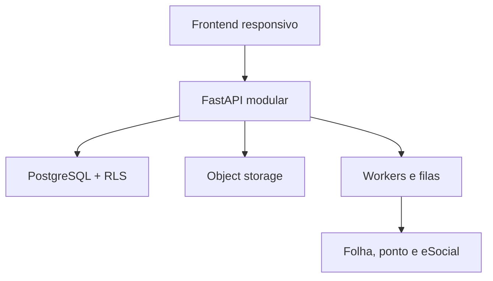
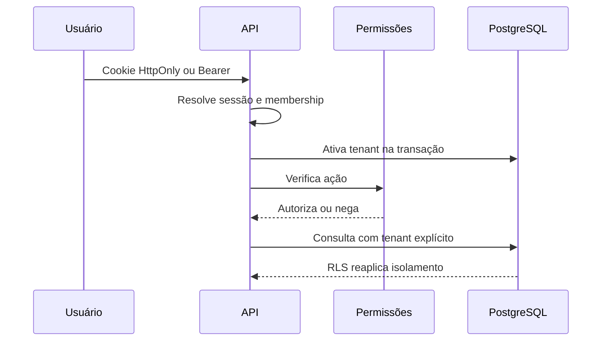

# Arquitetura do CHS RH

**Versão:** 1.1
**Data:** 28 de agosto de 2026

## Decisão central

O CHS RH começa como um **monólito modular Python/FastAPI**. Isso reduz custo operacional, preserva transações entre módulos e permite separar serviços quando escala, SLO ou requisitos regulatórios justificarem. O frontend operacional é servido pela mesma aplicação; autorização nunca depende apenas da interface.

## Fronteiras de domínio

| Módulo | Responsabilidade | Entidades centrais |
|---|---|---|
| Identidade | login, sessão, empresa ativa e papéis | User, Membership, SessionToken |
| Plataforma | tenant, tema, assinatura e módulos | Tenant, Subscription |
| ATS | requisição, banco de talentos, seleção e oferta | JobRequisition, Candidate, Vacancy, Application, Interview, Scorecard, Offer |
| Pessoas | estrutura, cadastro, contratos e movimentações | Department, Employee, EmploymentContract, EmployeeMovement |
| Jornada | onboarding, benefícios, ponto e holerites | OnboardingTemplate, BenefitEnrollment, TimeEntry, TimeAdjustment, Timesheet, PayrollBatch, PayrollStatement |
| Portal | atendimento, ausências e arquivos do colaborador | EmployeeRequest, LeaveRequest, EmployeeFile |
| Desempenho | ciclos, metas e avaliações | PerformanceCycle, PerformanceGoal, PerformanceReview |
| Conhecimento | fontes com ACL e respostas fundamentadas | KnowledgeDocument |
| Integrações | eventos versionados e idempotentes | ESocialEvent |
| Operações | KPIs, uso, faturas e evidências | UsageRecord, SaaSInvoice, AuditLog, FinancialReference |

## Isolamento multiempresa

O isolamento usa duas barreiras independentes:

1. toda tabela de negócio recebe `tenant_id`; o tenant é obtido da sessão, nunca do corpo da requisição, e consta explicitamente em cada consulta;
2. PostgreSQL Row-Level Security usa `current_setting('app.current_tenant_id', true)` com políticas `USING` e `WITH CHECK`.

Memberships e sessões ficam fora da RLS porque são usadas para descobrir o tenant antes de ativar o contexto. Testes negativos devem provar que IDs de outra empresa retornam 404.

## Identidade e autorização

- Argon2id para novas senhas e migração transparente dos hashes PBKDF2 legados após login válido;
- senha nova com no mínimo 15 caracteres, bloqueio de valores comuns e rejeição de partes óbvias da identidade;
- MFA TOTP com segredo criptografado, prevenção de replay e códigos de recuperação de uso único armazenados como HMAC;
- recuperação com resposta não enumerável, token aleatório de uso único, validade curta, revogação de sessões e entrega SMTP configurável;
- bloqueio temporário após cinco falhas e rate limit persistente por IP/identidade nas rotas sensíveis;
- token de sessão opaco; somente SHA-256 é persistido, com dispositivo, IP, user agent, último uso e motivo de revogação;
- navegador usa cookie `HttpOnly`, `SameSite=Strict` e `Secure` em produção, acompanhado por proteção CSRF; clientes de API podem usar Bearer;
- sessão tem limite absoluto, expiração por inatividade, máximo por usuário e revogação individual ou global;
- membership por usuário e empresa;
- papéis: proprietário, administrador, RH, recrutador, gestor, colaborador e auditor;
- permissões por ação verificadas no backend;
- ponto e holerite diferenciam acesso próprio de gestão de equipe.

### Acesso privilegiado

A elevação just-in-time somente amplia uma membership já existente no tenant. O solicitante informa permissões, motivo e duração de 5 a 120 minutos, confirma MFA recente e precisa da decisão de outro proprietário/administrador também com MFA recente. A ativação cria uma sessão separada, limitada ao menor vencimento, e toda solicitação, decisão, ativação, expiração ou revogação deixa evidência. O aprovador não pode aprovar o próprio pedido e não existe impersonação silenciosa.

TOTP reduz risco de senha roubada, mas não é resistente a phishing. WebAuthn/passkeys, SSO/SCIM, política de senha comprometida por serviço especializado, rate limit distribuído e políticas por unidade/equipe continuam como evoluções enterprise.

As escolhas acompanham [NIST SP 800-63B](https://pages.nist.gov/800-63-4/sp800-63b.html), [OWASP Authentication](https://cheatsheetseries.owasp.org/cheatsheets/Authentication_Cheat_Sheet.html), [OWASP Forgot Password](https://cheatsheetseries.owasp.org/cheatsheets/Forgot_Password_Cheat_Sheet.html) e [OWASP Session Management](https://cheatsheetseries.owasp.org/cheatsheets/Session_Management_Cheat_Sheet.html).

## Auditoria

Ações relevantes registram, na mesma transação, tenant, ator, ação, entidade, instante UTC, IP, request ID, detalhe e estado anterior/posterior. Falha na operação reverte também o evento. Produção deve replicar eventos para armazenamento append-only/SIEM.

## Migrations

Alembic é a estratégia de evolução do schema fora do SQLite de desenvolvimento. Produção não chama `create_all`. Deploy aplica `alembic upgrade head` em job único, executa smoke tests e só então libera tráfego. Mudanças destrutivas usam expand/contract.

## Frontend e tutorial

O shell possui busca, responsividade, estados vazios/erro/loading, dialogs nativos, claro/escuro e cinco paletas. O tutorial usa elementos reais, adapta passos às permissões, persiste versão e “Não exibir novamente” por membership e respeita `prefers-reduced-motion`.

O portal aplica escopo em três níveis no backend: próprio colaborador, equipe direta do gestor e administração de RH. Solicitações e férias têm máquinas de estado e auditoria; ausências ativas não podem se sobrepor. Arquivos mantêm metadados/checksum e separam visibilidade do colaborador de conteúdo exclusivo do RH.

Templates de onboarding geram tarefas transacionalmente a partir de uma data-base, com offsets e responsáveis derivados do vínculo. A combinação template/colaborador é única, evitando aplicação duplicada. Benefícios separam catálogo, regra de elegibilidade e adesão; o backend recalcula a elegibilidade antes de aceitar a solicitação e controla os estados da vigência.

## Assistente corporativo

A ordem obrigatória é ACL antes da recuperação:

- filtro de tenant e visibilidade;
- fontes versionadas para todos, gestores ou RH;
- resposta somente quando houver fonte;
- citações com documento, versão e trecho;
- abstenção sem evidência;
- auditoria sem registrar desnecessariamente a pergunta completa.

A evolução para pgvector/LLM mantém os mesmos filtros, adiciona defesa contra prompt injection, avaliações de groundedness e ferramentas allowlist. O modelo não toma decisões trabalhistas.

## Arquivos e integrações

Holerites binários devem residir em object storage privado com criptografia, antivírus, checksum e URL assinada curta. eSocial, folha, REP e benefícios entram por adapters versionados, jobs idempotentes, fila/dead-letter e secrets manager. Um modelo ou tela não significa homologação regulatória.

### Tratamento de jornada e folha

Marcações brutas não são editadas nem excluídas. Uma correção nasce como solicitação; quando aprovada, gera um evento derivado (`add`, `replace` ou `void`) com hash, preservando a marcação original. O espelho usa somente a visão efetiva, registra anomalias e, depois de fechado, permanece imutável. Novo cálculo gera uma versão que referencia a anterior.

Lotes de folha são importações, não cálculos. A chave idempotente impede repetição, as matrículas devem existir no tenant e cada linha precisa reconciliar bruto menos descontos com líquido. Somente lotes publicados aparecem ao colaborador. O binário continua fora do banco transacional.

O desenho segue as preocupações de integridade e comprovantes descritas na [Portaria MTP nº 671/2021 compilada](https://www.gov.br/trabalho-e-emprego/pt-br/assuntos/legislacao/portarias-1/portarias-vigentes-3/PDFPortarian671de8denovembrode2021compilada03.06.2024.pdf) e nas [orientações oficiais sobre REP](https://www.gov.br/trabalho-e-emprego/pt-br/assuntos/inspecao-do-trabalho/fiscalizacao-do-trabalho/rep). Ainda assim, o CHS RH não se declara REP-P: faltam assinatura/certificado, formatos oficiais, comprovantes e registro/homologação aplicáveis.

O núcleo atual já mantém eventos eSocial idempotentes e uma máquina de estados (`draft`, `validated`, `queued`, `sent`, `accepted`, `rejected`). A interface humana prepara e enfileira; o adapter deve registrar envio/aceite e um aceite exige recibo. Comunicação assinada, validação XSD e retentativas distribuídas pertencem ao adapter externo. Cobrança segue a mesma fronteira: uso e faturas internas são o ledger da aplicação; checkout, cartão, Pix, nota fiscal, webhooks e dunning ficam em gateway especializado.

## Quando separar serviços

Separar um módulo apenas diante de escala/SLO diferentes, isolamento regulatório, ciclo de deploy independente, trabalho intensivo incompatível com a API ou necessidade comprovada de isolamento de falha.
