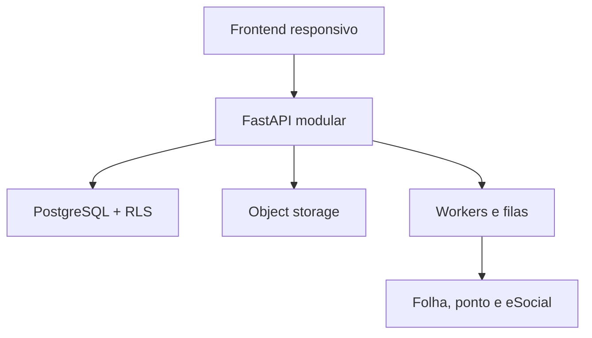
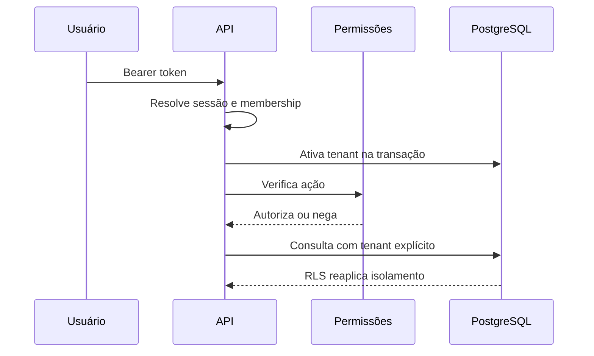

# Arquitetura do CHS RH

**Versão:** 1.0  
**Data:** 28 de agosto de 2026

## Decisão central

O CHS RH começa como um **monólito modular Python/FastAPI**. Isso reduz custo operacional, preserva transações entre módulos e permite separar serviços quando escala, SLO ou requisitos regulatórios justificarem. O frontend operacional é servido pela mesma aplicação; autorização nunca depende apenas da interface.

## Fronteiras de domínio

| Módulo | Responsabilidade | Entidades centrais |
|---|---|---|
| Identidade | login, sessão, empresa ativa e papéis | User, Membership, SessionToken |
| Plataforma | tenant, tema, assinatura e módulos | Tenant, Subscription |
| ATS | banco de talentos, vaga e processo | Candidate, Vacancy, Application |
| Pessoas | estrutura e cadastro mestre | Department, Employee |
| Jornada | onboarding, benefícios, ponto e holerites | OnboardingTask, BenefitPlan, TimeEntry, PayrollDocument |
| Conhecimento | fontes com ACL e respostas fundamentadas | KnowledgeDocument |
| Operações | KPIs, exportações e evidências | AuditLog, FinancialReference |

## Isolamento multiempresa

O isolamento usa duas barreiras independentes:

1. toda tabela de negócio recebe `tenant_id`; o tenant é obtido da sessão, nunca do corpo da requisição, e consta explicitamente em cada consulta;
2. PostgreSQL Row-Level Security usa `current_setting('app.current_tenant_id', true)` com políticas `USING` e `WITH CHECK`.

Memberships e sessões ficam fora da RLS porque são usadas para descobrir o tenant antes de ativar o contexto. Testes negativos devem provar que IDs de outra empresa retornam 404.

## Identidade e autorização

- PBKDF2-HMAC-SHA256 com salt aleatório e 600 mil iterações;
- token opaco; somente o SHA-256 é persistido;
- sessão expira e pode ser revogada;
- membership por usuário e empresa;
- papéis: proprietário, administrador, RH, recrutador, gestor, colaborador e auditor;
- permissões por ação verificadas no backend;
- ponto e holerite diferenciam acesso próprio de gestão de equipe.

Antes de produção ampla: recuperação de senha, MFA, rate limit, sessões por dispositivo, SSO/SCIM e políticas por unidade/equipe.

## Auditoria

Ações relevantes registram, na mesma transação, tenant, ator, ação, entidade, instante UTC, IP, request ID, detalhe e estado anterior/posterior. Falha na operação reverte também o evento. Produção deve replicar eventos para armazenamento append-only/SIEM.

## Migrations

Alembic é a estratégia de evolução do schema fora do SQLite de desenvolvimento. Produção não chama `create_all`. Deploy aplica `alembic upgrade head` em job único, executa smoke tests e só então libera tráfego. Mudanças destrutivas usam expand/contract.

## Frontend e tutorial

O shell possui busca, responsividade, estados vazios/erro/loading, dialogs nativos, claro/escuro e cinco paletas. O tutorial usa elementos reais, adapta passos às permissões, persiste versão e “Não exibir novamente” por membership e respeita `prefers-reduced-motion`.

## Assistente corporativo

A ordem obrigatória é ACL antes da recuperação:

- filtro de tenant e visibilidade;
- fontes versionadas para todos, gestores ou RH;
- resposta somente quando houver fonte;
- citações com documento, versão e trecho;
- abstenção sem evidência;
- auditoria sem registrar desnecessariamente a pergunta completa.

A evolução para pgvector/LLM mantém os mesmos filtros, adiciona defesa contra prompt injection, avaliações de groundedness e ferramentas allowlist. O modelo não toma decisões trabalhistas.

## Arquivos e integrações

Holerites binários devem residir em object storage privado com criptografia, antivírus, checksum e URL assinada curta. eSocial, folha, REP e benefícios entram por adapters versionados, jobs idempotentes, fila/dead-letter e secrets manager. Um modelo ou tela não significa homologação regulatória.

## Quando separar serviços

Separar um módulo apenas diante de escala/SLO diferentes, isolamento regulatório, ciclo de deploy independente, trabalho intensivo incompatível com a API ou necessidade comprovada de isolamento de falha.
