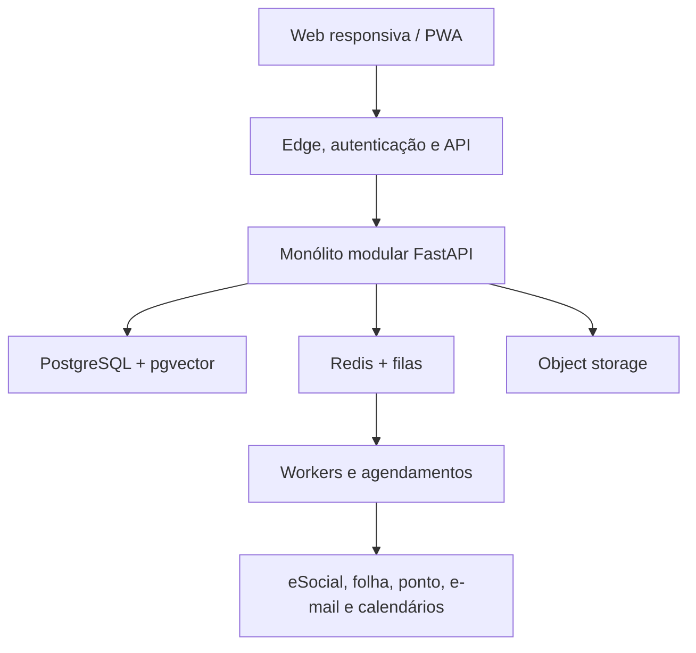

# Plano mestre de evolução — CHS Recruta para SaaS completo de RH

- **Status:** documento de arquitetura e produto para implementação incremental
- **Data da análise:** 27 de agosto de 2026
- **Baseline analisada:** `main@ec67e73`
- **Escopo:** transformar o MVP atual em uma plataforma SaaS multiempresa para recrutadores, RH, Departamento Pessoal, gestores, colaboradores e administradores da plataforma.

> Este documento substitui o roadmap resumido anterior. Ele descreve decisões, dependências, riscos e critérios de saída. Não significa que os módulos listados já existam. Requisitos trabalhistas, fiscais, contábeis e de proteção de dados devem passar por validação jurídica e contábil antes de cada liberação em produção.

## 1. Resumo executivo

O repositório atual é uma boa prova de conceito backend-first: possui FastAPI, SQLAlchemy, autenticação por sessão bearer, dois perfis de acesso, candidatos, vagas, matching simples por profissão, dashboard básico, auditoria, exportação CSV, Docker e CI. Os três testes existentes passam.

Ele ainda **não é um SaaS** nem um sistema completo de RH. Todos os dados estão no mesmo espaço global; não existe empresa/tenant, colaborador, vínculo empregatício, folha, holerite, ponto, férias, benefícios, onboarding, portal operacional ou base de conhecimento. A interface web atual é somente uma landing page que direciona à documentação da API.

A evolução recomendada é:

1. manter Python/FastAPI e migrar para um **monólito modular**, evitando microserviços prematuros;
2. criar uma fundação multiempresa, auditável e segura antes de adicionar dados trabalhistas;
3. separar candidato, pessoa, colaborador, vínculo e usuário — são entidades diferentes;
4. transformar o ATS em produto completo e, em seguida, construir Core RH e portal do colaborador;
5. lançar ponto e folha inicialmente por **integrações certificadas**, avaliando motores próprios como projetos regulatórios separados;
6. implementar o chatbot RAG com isolamento por empresa, permissões por documento e respostas com fontes;
7. oferecer módulos por plano, feature flags e limites de uso, com operação, suporte e faturamento próprios de SaaS.

## 2. Diagnóstico comprovado do sistema atual

| Área | O que existe | Avaliação para SaaS |
|---|---|---|
| Backend | FastAPI, SQLAlchemy 2 e Pydantic | Base aproveitável |
| Banco | PostgreSQL configurável e SQLite como fallback | Não há migrations, tenant ou política de isolamento |
| Autenticação | Sessões bearer com token aleatório e hash no banco | Falta recuperação de senha, MFA, SSO, dispositivos, rotação e política por empresa |
| Autorização | `admin` e `recruiter` | Insuficiente; permissões são globais e fixas |
| Candidatos | CRUD, busca textual e detecção simples de duplicidade | Sem paginação, consentimento, anexos, histórico completo ou múltiplas candidaturas |
| Vagas | Criar, listar e consultar | Não há atualização, exclusão, aprovação, publicação ou pipeline configurável |
| Matching | Igualdade de profissão normalizada | Não considera competências, disponibilidade, região, senioridade ou explicação de score |
| Dashboard | Totais e funil por status | Métricas não são filtráveis por empresa, período, vaga, recrutador ou fonte |
| Auditoria | Registro de ação, entidade, ator e texto livre | Não registra diffs, IP, request ID, tenant, motivo ou retenção imutável |
| Financeiro | Tabela de referências com `float` | Não é faturamento SaaS nem folha; dinheiro deve usar `Numeric/Decimal` |
| Frontend | HTML/CSS estático | Não há aplicação de trabalho para RH ou colaborador |
| Qualidade | 3 testes e CI de compilação/teste | Cobertura insuficiente; existe aviso de depreciação no TestClient |
| Deploy | Docker, Compose e Vercel | Não há infraestrutura de produção, secrets, backups, observabilidade ou ambientes separados |

### 2.1 Problemas estruturais que precisam ser corrigidos antes de escalar

- `Base.metadata.create_all()` roda na importação; o schema não possui histórico de migrations.
- `Candidate.vacancy_id` permite apenas uma vaga por candidato e perde o histórico de candidaturas.
- `Candidate.recruiter` e `Vacancy.owner` são textos livres, não relacionamentos com usuários.
- status e funil são enums globais; empresas não podem configurar etapas, SLAs ou motivos.
- unicidade de usuário, e-mail e código de vaga é global; em SaaS ela precisa considerar o tenant quando aplicável.
- exclusão de candidato é física; não há retenção, anonimização, legal hold ou restauração.
- busca de duplicidade carrega todos os candidatos e compara em Python, o que não escala.
- endpoints retornam listas inteiras sem paginação e filtros server-side.
- criação de referência financeira não exige perfil administrativo e não gera auditoria.
- logs podem ser consultados por qualquer usuário autenticado e misturam todos os dados.
- não há proteção contra brute force, rate limit, CSRF para futuros cookies, CORS controlado ou cabeçalhos de segurança.
- não há lockfile, análise de dependências, lint, type check, SAST, DAST, SBOM ou scan de imagem Docker.
- a branch `main` não está protegida.

## 3. Visão do produto

O CHS Recruta deve evoluir para uma plataforma modular chamada, provisoriamente, **CHS RH**, preservando “CHS Recruta” como nome do módulo ATS. Cada empresa contrata os módulos de que precisa.

### 3.1 Personas atendidas

- administrador da plataforma SaaS;
- proprietário/administrador da empresa cliente;
- RH generalista e Departamento Pessoal;
- recrutador e Talent Acquisition;
- gestor de área e aprovador;
- colaborador, estagiário, aprendiz e prestador, com escopos distintos;
- candidato externo;
- auditor/DPO/encarregado com acesso restrito;
- contador ou parceiro de folha, quando autorizado.

### 3.2 Módulos do produto

1. Plataforma SaaS e administração multiempresa.
2. Identidade, acessos e segurança.
3. ATS/Recrutamento e Seleção.
4. Core RH/HRIS e organograma.
5. Admissão, onboarding, movimentação e desligamento.
6. Portal e autoatendimento do colaborador.
7. Jornada, ponto, escalas, banco de horas e ausências.
8. Holerites, folha e integrações de Departamento Pessoal.
9. Férias, benefícios, documentos e assinaturas.
10. Desempenho, PDI, competências, sucessão e carreira.
11. Treinamentos, certificações, pesquisas e clima.
12. Saúde e Segurança do Trabalho, por integrações e escopo controlado.
13. Analytics, relatórios, workflows e automações.
14. Assistente corporativo RAG.
15. API, webhooks, marketplace de integrações e importação/exportação.
16. Planos, assinatura, cobrança, suporte e operação do SaaS.

## 4. Arquitetura-alvo recomendada



### 4.1 Decisões técnicas

- **Monorepo:** `apps/api`, `apps/web`, `apps/worker`, `packages/ui` e `packages/api-client`.
- **Frontend:** Next.js + TypeScript, com design system, aplicação responsiva e PWA. O frontend nunca aplica autorização sozinho; a API repete todas as verificações.
- **Backend:** FastAPI organizado por módulos de domínio, com camada de aplicação, domínio e infraestrutura. Rotas não devem concentrar regras de negócio.
- **Banco:** PostgreSQL. SQLite permanece apenas para testes unitários muito simples; testes de integração usam PostgreSQL real.
- **Multi-tenancy inicial:** banco e schema compartilhados, `tenant_id` obrigatório em todas as tabelas de negócio, chaves únicas compostas e PostgreSQL Row-Level Security. Clientes enterprise podem futuramente receber banco dedicado.
- **Assíncrono:** Redis e workers para e-mails, geração de documentos, importações, indexação RAG, webhooks e integrações.
- **Arquivos:** object storage compatível com S3, URLs assinadas de curta duração, antivírus, checksum, versionamento e retenção.
- **RAG inicial:** PostgreSQL + pgvector reduz complexidade. Um vector store separado só deve ser adotado após métricas demonstrarem necessidade.
- **Eventos:** transactional outbox, consumidores idempotentes e dead-letter queue. Evitar dual write entre banco e integrações.
- **API:** `/api/v1`, paginação por cursor, filtros, ordenação, idempotency keys, ETags quando úteis, webhooks assinados e OpenAPI versionada.
- **Datas:** armazenar instantes em UTC com precisão total e timezone explícito; exibir no fuso da empresa. Interfaces podem mostrar `HH:MM`, mas a auditoria não deve perder segundos/milissegundos internamente.
- **Valores:** `Decimal`/`Numeric`, moeda ISO 4217 e regras explícitas de arredondamento; nunca `float` para folha, benefícios ou cobrança.

### 4.2 Estrutura modular sugerida

```text
apps/api/app/
├── platform/        # tenants, planos, billing, feature flags
├── identity/        # usuários, memberships, roles, SSO, MFA
├── people/          # pessoas, colaboradores, vínculos e estrutura
├── recruiting/      # vagas, candidatos, candidaturas e entrevistas
├── onboarding/      # admissão, tarefas, documentos e assinaturas
├── time_attendance/ # escalas, marcações, espelhos e ajustes
├── payroll/         # holerites, importações e integrações
├── talent/          # desempenho, PDI, skills, carreira e pesquisas
├── knowledge/       # fontes, chunks, ACL e conversas RAG
├── workflows/       # regras, tarefas, notificações e aprovações
├── integrations/    # adapters, webhooks, outbox e credenciais
├── audit/           # trilha imutável, privacidade e evidências
└── shared/          # config, erros, observabilidade e utilitários
```

## 5. Modelo de dados e migração da base atual

### 5.1 Entidades fundamentais

- `Tenant`, `LegalEntity`, `Establishment`, `Department`, `CostCenter`, `Position`, `JobLevel` e `WorkLocation`.
- `Person` para identidade civil; `Employee` para relação interna; `EmploymentContract` para cada vínculo; `User` para autenticação; `Membership` para acesso a tenants.
- `Role`, `Permission`, `RolePermission`, `MembershipRole` e políticas contextuais por unidade/departamento.
- `Candidate`, `Vacancy`, `Application`, `Pipeline`, `PipelineStage`, `ApplicationStageHistory`, `Interview`, `Scorecard`, `Offer` e `TalentPool`.
- `Document`, `DocumentVersion`, `DocumentACL`, `SignatureRequest`, `ConsentRecord` e `RetentionPolicy`.
- `AuditEvent` append-only, com ator, tenant, IP, user agent, request/correlation ID, antes/depois em JSONB, motivo e timestamp.

### 5.2 Migração segura

1. Introduzir Alembic e criar uma migration baseline do schema atual.
2. Criar `tenants`, `memberships`, roles e permissions.
3. Criar um tenant padrão para os dados existentes.
4. Adicionar `tenant_id` inicialmente anulável, fazer backfill, validar e só então aplicar `NOT NULL` e RLS.
5. Trocar unicidades globais por compostas quando o domínio permitir.
6. Converter `recruiter` e `owner` em FKs, mantendo snapshots de nome para histórico.
7. Criar `applications` e migrar cada `candidate.vacancy_id` existente para uma candidatura.
8. Substituir hard delete por `deleted_at`, anonimização e políticas de retenção.
9. Transformar auditoria em eventos estruturados e imutáveis.
10. Migrar valores monetários de `Float` para `Numeric`, com testes de reconciliação.
11. Executar migrations expand/contract para deploy sem indisponibilidade.
12. Criar scripts de verificação, contagem e rollback; registrar evidências da migração.

## 6. Implementações funcionais

### 6.1 Plataforma SaaS e multiempresa

- cadastro de empresa, CNPJ, unidades, timezone, moeda, idioma, calendário e identidade visual;
- wizard de implantação e importação assistida;
- convite de usuários, memberships e troca segura de empresa;
- planos, módulos contratados, limites, trial, cupons, assinatura, cobrança e inadimplência;
- feature flags por tenant, rollout gradual e kill switch;
- console interno de suporte com acesso just-in-time, aprovação, motivo e auditoria;
- exportação completa e encerramento do tenant com retenção configurável;
- quotas de armazenamento, usuários, colaboradores, vagas, indexação RAG e consumo de IA;
- status page, central de ajuda, tickets e comunicação de incidentes.

### 6.2 ATS/Recrutamento e Seleção

- requisição de pessoal com headcount, centro de custo, faixa salarial e fluxo de aprovação;
- vagas internas, externas, confidenciais, recorrentes e banco de reserva;
- portal de carreiras acessível, SEO, formulário configurável e candidatura mobile;
- publicação por integrações com job boards e rastreio de origem/UTM;
- candidato com contatos, currículo, documentos, skills, disponibilidade, pretensão, regiões e preferências;
- candidaturas independentes, histórico de etapas, motivos de perda, SLA e aging;
- pipeline configurável por empresa/vaga, drag-and-drop e automações por etapa;
- busca global e fuzzy por nome, telefone, e-mail, profissão, cidade, conselho e skills;
- detecção de duplicidade indexada e merge revisável, nunca fusão silenciosa;
- inbox de recrutamento, templates, consentimento e opt-out;
- entrevistas, agenda, participantes, lembretes, scorecards e critérios estruturados;
- oferta, aprovações, aceite, documentos e conversão candidato → pessoa/colaborador sem redigitação;
- talent pools, tags, listas, campanhas e rediscovery;
- validação de registros profissionais por adapter: COREN, CREFITO, CRN, CRFa e outros, mantendo evidência, data, origem e revisão humana;
- matching explicável por regras e pesos configuráveis, sem decisão automática final e sem inferir atributos sensíveis;
- métricas: time-to-hire, time-to-fill, aging, conversão por etapa/profissão, source-of-hire, escassez, carga por recrutador, sem resposta e candidatos não trabalhados;
- importação CSV/XLSX com mapeamento, preview, validação, idempotência e relatório de erros;
- exportação com controle de permissão, justificativa e marca d'água quando necessário.

### 6.3 Requisitos operacionais já esperados no CHS Recruta

- mostrar data e horário de cadastro e última atualização no perfil do candidato;
- registrar toda alteração, com filtros por data, hora, ator, ação e entidade;
- exibir horários em `HH:MM` para a rotina, preservando precisão completa no banco;
- busca fixa no cabeçalho, com resultados flutuantes e acesso direto ao cadastro;
- filtros “sem resposta”, profissão, fonte, recrutador, região, vaga e período;
- dashboard com KPIs, conversão por profissão, melhores fontes, escassez e taxa de sucesso;
- padronização de profissão sem duplicar categorias por gênero;
- modo claro/escuro e temas rosa, ciano, roxo, verde-musgo e laranja, sem comprometer contraste;
- rótulos profissionais adequados: “Recursos Humanos” é função exibida; permissões administrativas continuam separadas;
- responsividade para celular e desktop, atalhos de teclado e navegação acessível.

### 6.4 Core RH/HRIS

- cadastro mestre de pessoa e colaborador, matrícula, vínculo, unidade, cargo, salário, gestor, jornada e centro de custo;
- múltiplos vínculos e histórico temporal sem sobrescrever dados passados;
- organograma, headcount planejado/real e posições abertas;
- dependentes, contatos de emergência e dados bancários com acesso altamente restrito;
- movimentações, promoções, transferências, alterações salariais e aprovações;
- diretório corporativo com campos públicos e privados;
- documentos, validade, alertas, versões e assinatura eletrônica;
- políticas de retenção por tipo de dado e finalidade;
- dossiê do colaborador com trilha cronológica e segregação de campos sensíveis;
- relatórios cadastrais e exportações para contabilidade/folha.

### 6.5 Admissão, onboarding e offboarding

- checklist configurável por cargo, unidade, tipo de vínculo e trabalho remoto/presencial;
- coleta segura de documentos, validação, pendências e expiração;
- tarefas para RH, gestor, TI, Facilities, financeiro e colaborador;
- contratos e políticas versionadas com aceite/assinatura;
- provisionamento e desprovisionamento por integrações;
- pesquisa de experiência de admissão e indicadores de conclusão;
- conversão controlada do ATS para admissão, com minimização de dados;
- offboarding com entrevistas, devolução de ativos, revogação de acessos, documentos e retenção.

### 6.6 Portal do colaborador e do gestor

- perfil e solicitações de alteração cadastral com aprovação;
- holerites, informes, documentos, contratos e políticas;
- ponto, espelho, banco de horas, ajustes, justificativas e aprovações;
- férias, folgas, ausências, atestados e saldo;
- benefícios, dependentes e solicitações;
- tarefas de onboarding, treinamentos e avaliações;
- central de comunicados, notificações e caixa de entrada;
- chatbot corporativo com respostas baseadas em fontes autorizadas;
- área do gestor para equipe, aprovações, indicadores e alertas, sem acesso indevido a dados sensíveis.

### 6.7 Jornada, ponto, escalas e ausências

#### Estratégia de lançamento

**Primeira opção recomendada:** integrar provedores de REP e programas de tratamento já adequados, importando marcações, espelhos e saldos. Isso entrega valor mais cedo e reduz risco regulatório.

**Motor próprio REP-P:** tratar como produto regulatório independente. Não anunciar conformidade antes de certificações, registro, atestados, testes e validação especializada.

#### Capacidades do domínio

- escalas fixas, flexíveis, 12x36, turnos, tolerâncias, intervalos e jornadas noturnas;
- marcações imutáveis e ajustes como eventos separados com motivo, aprovador e evidência;
- modo online/offline, sincronização e prevenção de duplicidade;
- geolocalização e foto somente quando proporcionais, transparentes e juridicamente validadas;
- banco de horas, horas extras, adicional noturno, atrasos, faltas e fechamento;
- solicitações, aprovações multinível, contestação e assinatura do espelho;
- integrações com folha e exportação por período;
- alta disponibilidade, monitoramento de relógio e trilha antifraude.

Se o CHS construir REP-P próprio, a implementação deve contemplar, entre outros requisitos da Portaria MTP nº 671/2021 compilada: identificação de empresa e trabalhador, NSR, hash SHA-256, sincronismo com Hora Legal Brasileira, Armazenamento de Registro de Ponto redundante, comprovante após cada marcação, AFD, AEJ, Espelho de Ponto, assinaturas ICP-Brasil nos padrões exigidos, disponibilidade para fiscalização e Atestado Técnico e Termo de Responsabilidade.

### 6.8 Holerites, folha e eSocial

#### Etapa 1 — hub de holerites e integrações

- importar holerites e metadados de sistemas de folha com layout versionado;
- reconciliar competência, matrícula, CPF mascarado, estabelecimento e checksum;
- armazenar documento criptografado, versionado e com acesso individual;
- publicar com notificação, confirmação de acesso e trilha de auditoria;
- reprocessar lotes com idempotência e relatório de inconsistências;
- permitir informe de rendimentos, férias, rescisão e documentos relacionados;
- integrar folha/ponto por adapters, SFTP seguro, API ou arquivos assinados.

#### Etapa 2 — conector eSocial

- layouts/XSD versionados, ambientes separados, certificados e secrets em cofre;
- validação local, assinatura, envio, consulta de recibo, retries e reconciliação;
- dependências entre eventos, idempotência, fila, dead-letter e reprocessamento;
- painel de eventos rejeitados, prazos, responsáveis e evidências;
- atualização desacoplada quando o eSocial publicar nova nota técnica.

#### Etapa 3 — motor de folha próprio, somente após decisão de produto

- rubricas versionadas, bases, incidências, retroativos e cálculos por competência;
- admissão, férias, 13º, afastamentos, rescisão, pensão e múltiplos vínculos;
- encargos, tributos, FGTS, fechamento, contabilização e conciliação;
- testes de golden files, cálculo paralelo e homologação contábil;
- dupla aprovação, fechamento imutável, reabertura formal e trilha completa.

O eSocial é uma integração versionada e mutável; o código não deve assumir que o layout atual permanecerá estável. A documentação oficial disponível na data desta análise lista os leiautes S-1.3 e respectivos XSDs/notas técnicas.

### 6.9 Férias, benefícios e casos de RH

- políticas e saldos de férias/folgas, solicitações, conflitos e aprovações;
- calendário de equipe e alertas de vencimento;
- catálogo de benefícios, elegibilidade, adesão, dependentes e coparticipação;
- integrações com operadoras e conciliação de movimentações;
- central restrita para casos de RH, medidas disciplinares e relações trabalhistas;
- anexos e comentários com ACL por caso, legal hold e prazos;
- atestados e afastamentos com minimização de dados de saúde e acesso segregado.

### 6.10 Desempenho, desenvolvimento e experiência

- ciclos de avaliação, competências, metas, feedback e calibração;
- 1:1, PDI, planos de ação e acompanhamento;
- matriz de talentos/sucessão com critérios transparentes;
- trilhas de aprendizagem, cursos, presenças e certificados;
- pesquisas de clima, pulso e eNPS com anonimato mínimo por grupo;
- reconhecimento, comunicados e eventos;
- analytics de diversidade apenas com base legal, finalidade, agregação e controle rigoroso.

### 6.11 Assistente corporativo RAG

#### Fontes e ingestão

- upload e conectores para políticas, manuais, benefícios, procedimentos e FAQs;
- extração, OCR, classificação, versionamento, chunking e embeddings;
- owner, validade, data de revisão e workflow de publicação;
- ACL herdada do documento, tenant, unidade, cargo e público-alvo;
- reindexação e remoção garantida quando uma fonte for revogada.

#### Resposta segura

- recuperação sempre filtrada por tenant e ACL antes da similaridade;
- resposta com citações clicáveis, versão da fonte e data;
- mensagem explícita quando não houver evidência suficiente;
- histórico e feedback configuráveis, com retenção e redaction de PII;
- proteção contra prompt injection em documentos e ferramentas;
- ferramentas allowlist para consultas estruturadas: o colaborador só consulta seus próprios dados; o gestor, apenas seu escopo;
- escalonamento para RH e abertura de ticket quando a dúvida exigir decisão humana;
- avaliação contínua de groundedness, precisão de citação, vazamento entre tenants, latência, custo e satisfação;
- nenhum conteúdo de cliente usado para treinar modelos por padrão;
- matching e decisões de emprego não devem ser delegados ao chatbot.

#### Casos de uso iniciais

- “Qual é a política de férias?”;
- “Como solicito reembolso?”;
- “Onde encontro meu holerite?”;
- “Quais documentos faltam no meu onboarding?”;
- “Qual o prazo desta tarefa?”;
- resumo de política com links para a fonte, sem inventar regras.

### 6.12 Analytics, workflows e automações

- construtor de relatórios com catálogo de métricas e escopo por permissão;
- dashboards por módulo, período, unidade, gestor e centro de custo;
- métricas calculadas a partir de eventos, com definição e linhagem;
- exportação agendada e compartilhamento seguro;
- workflows no-code com gatilho, condições, aprovações, ações e SLA;
- templates de e-mail/notificação por tenant, idioma e contexto;
- jobs reexecutáveis e idempotentes, com logs e dead-letter;
- warehouse/BI somente quando o volume justificar, com dados pseudonimizados.

### 6.13 Integrações e plataforma de desenvolvedores

- API pública com OAuth2 client credentials, scopes, quotas e versionamento;
- webhooks HMAC, retry, replay e portal de entrega;
- SSO OIDC/SAML e SCIM para clientes enterprise;
- e-mail, calendário, videoconferência e assinatura eletrônica;
- job boards, portais de carreira e redes profissionais;
- folha, ponto, benefícios, contabilidade e eSocial;
- importadores CSV/XLSX/SFTP com layouts versionados;
- marketplace de adapters, sandbox e credenciais separadas por ambiente.

## 7. Segurança, privacidade e conformidade

### 7.1 LGPD by design

- mapear papéis: em regra, empresa cliente como controladora e CHS como operadora, confirmados contratualmente por caso;
- inventário/ROPA de operações, finalidades, bases legais, categorias, destinatários e retenção;
- DPA, subprocessadores, transferências internacionais e canal do encarregado;
- portal para solicitações do titular: acesso, correção, portabilidade quando aplicável, oposição, anonimização/bloqueio/exclusão conforme análise;
- consentimento somente quando for a base adequada, com versão, finalidade e revogação;
- privacy notice específico para candidatos e colaboradores;
- DPIA/RIPD para tratamentos de maior risco, biometria, geolocalização e IA;
- minimização, masking, pseudonimização e ambientes de teste sem dados reais;
- retenção automatizada, legal hold, anonimização verificável e evidência de exclusão;
- plano de resposta a incidentes e fluxo de comunicação aplicável.

### 7.2 Controles técnicos mínimos

- MFA para administradores/RH e opção de obrigatoriedade por tenant;
- password reset seguro, detecção de credenciais vazadas e políticas modernas;
- SSO enterprise, sessões por dispositivo, revogação global e step-up auth;
- RBAC + ABAC por tenant, unidade, departamento, equipe e propriedade do dado;
- RLS no PostgreSQL e testes automatizados de isolamento entre tenants;
- criptografia em trânsito e repouso; field-level encryption para dados críticos;
- secrets manager, KMS, rotação de chaves e separação por ambiente;
- rate limit, WAF, proteção de login, CSP, cookies seguros quando adotados e CORS restrito;
- audit log append-only exportável para SIEM, com alertas de comportamento suspeito;
- backups com PITR, restore testado, RPO/RTO definidos e disaster recovery;
- SAST, dependency/container scan, secret scan, SBOM, DAST e pentest antes do lançamento;
- política de vulnerabilidades, patches, incidentes, acesso privilegiado e offboarding interno.

### 7.3 IA responsável

- uso assistivo, explicável e revisável; decisão final de contratação ou carreira permanece humana;
- proibição de inferir saúde, raça, religião, orientação sexual, gravidez ou outros atributos sensíveis;
- avaliação de viés e performance por grupos somente quando juridicamente permitido e com dados adequados;
- registro de versão do modelo, prompt, fontes, ferramentas, decisão humana e override;
- contratos com provedores de IA devem tratar retenção, treinamento, região, subprocessadores e segurança;
- red teaming contra exfiltração, prompt injection, jailbreak e cross-tenant leakage.

## 8. Experiência, acessibilidade e design

- design system com tokens, componentes, documentação e testes visuais;
- WCAG 2.2 AA como meta: teclado, foco, contraste, labels, leitor de tela e redução de movimento;
- linguagem clara para profissionais de RH não técnicos;
- navegação distinta por persona e módulos contratados;
- tabelas densas com filtros salvos, colunas configuráveis e ações em lote seguras;
- estados vazios, loading, erro, retry, autosave e prevenção de perda de dados;
- notificações centralizadas com preferências e digest;
- responsividade real e PWA antes de considerar aplicativos nativos;
- localização pt-BR, timezone por empresa e preparação para i18n.

## 9. Roadmap por fases e gates

Estimativas de calendário dependem de equipe e não devem ser tratadas como promessa. Uma fase só avança quando seus critérios de saída forem demonstrados.

| Fase | Resultado | Dependências | Gate de saída |
|---|---|---|---|
| 0 — Descoberta e baseline | Escopo, arquitetura, mapa de dados e contratos de domínio | Nenhuma | ADRs aprovadas, threat model, inventário LGPD e testes baseline |
| 1 — Fundação SaaS | Tenants, IAM, migrations, auditoria, frontend shell e observabilidade | Fase 0 | Teste automático prova ausência de acesso cross-tenant; backup restaurado |
| 2 — ATS completo | Requisição, vaga, candidatura, pipeline, entrevistas, oferta e portal | Fase 1 | Fluxo ponta a ponta e métricas reconciliadas |
| 3 — Core RH e portal | Pessoas, vínculos, estrutura, documentos, onboarding e autoatendimento | Fase 1/2 | Admissão → colaborador → desligamento com auditoria e retenção |
| 4 — Jornada e ausências | Integração de ponto, escalas, ajustes, espelhos, férias e aprovações | Fase 3 | Homologação operacional e regulatória; fechamento reconciliado |
| 5 — Holerites/DP | Hub de holerites, adapters de folha e conector eSocial | Fase 3/4 | Lote idempotente, acesso individual e reconciliação sem divergência |
| 6 — RAG corporativo | Ingestão, ACL, chat com citações, avaliação e tickets | Fase 1/3 | Zero vazamento em testes cross-tenant/ACL e metas de groundedness |
| 7 — Talentos e escala | Desempenho, PDI, L&D, clima, billing avançado e enterprise | Fases anteriores | SLOs, segurança e operação comercial sustentáveis |

### 9.1 Backlog P0 — iniciar antes de qualquer módulo sensível

- [ ] `FND-001` Criar ADRs para multi-tenancy, autenticação, arquivos, RAG, ponto e folha.
- [ ] `FND-002` Reestruturar o repositório como monorepo e criar frontend TypeScript.
- [ ] `FND-003` Implantar Alembic e migration baseline.
- [ ] `FND-004` Criar tenant, membership, roles, permissions e contexto de requisição.
- [ ] `FND-005` Adicionar `tenant_id`, chaves compostas, RLS e suíte de isolamento.
- [ ] `FND-006` Implementar auditoria estruturada append-only e filtros autorizados.
- [ ] `FND-007` Implementar soft delete, retenção, anonimização e legal hold.
- [ ] `FND-008` Criar `/api/v1`, paginação, filtros, erros padronizados e idempotência.
- [ ] `FND-009` Configurar ambientes dev/staging/prod, secrets e migrations no deploy.
- [ ] `FND-010` Adicionar logs estruturados, request ID, métricas, traces e alertas.
- [ ] `FND-011` Configurar backup/PITR e executar teste documentado de restore.
- [ ] `FND-012` Expandir CI com lint, type check, testes PostgreSQL e scans de segurança.
- [ ] `FND-013` Proteger `main`, exigir CI e revisão para mudanças futuras.
- [ ] `FND-014` Definir SLOs, runbooks, resposta a incidentes e política de vulnerabilidades.
- [ ] `FND-015` Corrigir o aviso de depreciação do TestClient e fixar dependências reproduzíveis.

### 9.2 Backlog P1 — primeiro produto vendável

- [ ] `ATS-001` Separar candidato de candidatura e migrar dados existentes.
- [ ] `ATS-002` Pipeline configurável, histórico de etapa, motivos e SLA.
- [ ] `ATS-003` Requisição e aprovação de vaga.
- [ ] `ATS-004` Portal de carreiras e candidatura com privacidade/consentimento.
- [ ] `ATS-005` Currículos, documentos, skills, certificações e talent pools.
- [ ] `ATS-006` Busca global, filtros salvos, paginação e duplicidade indexada.
- [ ] `ATS-007` Entrevistas, agenda, scorecards e feedback estruturado.
- [ ] `ATS-008` Oferta e conversão controlada para admissão.
- [ ] `ATS-009` Comunicação por templates, opt-out e histórico.
- [ ] `ATS-010` Dashboard completo e catálogo de métricas.
- [ ] `ATS-011` Importação/exportação segura CSV/XLSX.
- [ ] `ATS-012` Adapters de conselhos profissionais e evidências de validação.
- [ ] `UX-001` Aplicação RH com data/hora visível, busca no cabeçalho e logs filtráveis.
- [ ] `UX-002` Temas, claro/escuro, responsividade e acessibilidade AA.

### 9.3 Backlog P1/P2 — Core RH e colaborador

- [ ] `HRIS-001` Pessoa, colaborador, vínculos e histórico temporal.
- [ ] `HRIS-002` Empresas legais, unidades, cargos, posições, gestores e centros de custo.
- [ ] `HRIS-003` Organograma e headcount.
- [ ] `DOC-001` Documentos versionados, ACL, validade e assinatura.
- [ ] `ONB-001` Onboarding/offboarding configurável e tarefas interáreas.
- [ ] `ESS-001` Portal do colaborador e área do gestor.
- [ ] `LEAVE-001` Férias, folgas, ausências, atestados e aprovações.
- [ ] `BEN-001` Benefícios, elegibilidade, dependentes e integrações.
- [ ] `WF-001` Motor de workflows, aprovações e notificações.

### 9.4 Backlog regulatório e de IA

- [ ] `TIME-001` Escolher integração certificada versus REP-P próprio por ADR e parecer especializado.
- [ ] `TIME-002` Modelo imutável de marcações, ajustes, escalas e fechamento.
- [ ] `TIME-003` Integração com REP, espelho e banco de horas.
- [ ] `TIME-004` Se REP-P próprio: implementar e homologar integralmente requisitos aplicáveis.
- [ ] `PAY-001` Hub seguro de holerites e importação idempotente.
- [ ] `PAY-002` Adapters de folha e reconciliação.
- [ ] `PAY-003` Conector eSocial versionado com XSD, recibos e reprocessamento.
- [ ] `PAY-004` Decidir separadamente se haverá motor de folha próprio.
- [ ] `RAG-001` Knowledge base versionada com owner, ACL e retenção.
- [ ] `RAG-002` Pipeline de ingestão, OCR, chunking, embeddings e exclusão.
- [ ] `RAG-003` Chat com citações, abstenção e escalonamento.
- [ ] `RAG-004` Ferramentas permissionadas para consultas pessoais/gerenciais.
- [ ] `RAG-005` Avaliação offline/online e suíte contra vazamento/prompt injection.

## 10. Estratégia de testes e Definition of Done

### 10.1 Pirâmide de testes

- unitários para regras de domínio, cálculo, permissões e transições;
- integração com PostgreSQL, Redis, object storage e adapters;
- contract tests para eSocial, folha, ponto, e-mail e webhooks;
- E2E para login, contratação, admissão, publicação de holerite e aprovação de ponto;
- segurança: autorização negativa, cross-tenant, IDOR, upload malicioso e rate limit;
- migrations: upgrade/downgrade, backfill e expand/contract em cópia sanitizada;
- carga: busca, listagens, marcações de ponto e ingestão de documentos;
- RAG: precisão de citação, abstenção, ACL, prompt injection e remoção de fonte.

### 10.2 Definition of Done comum

Uma entrega só está concluída quando:

- critérios funcionais e de autorização foram automatizados;
- isolamento por tenant e auditoria foram testados;
- migration e rollback/roll-forward foram validados;
- logs, métricas, traces e alertas existem;
- acessibilidade, responsividade e estados de erro foram verificados;
- documentação de usuário, API e runbook foram atualizados;
- risco LGPD/segurança foi classificado;
- feature flag e plano de rollout/rollback estão definidos;
- nenhum secret ou dado pessoal real foi incluído no repositório.

## 11. Métricas e SLOs iniciais

### Produto

- ativação do tenant, tempo até primeira vaga e tempo até primeiro colaborador importado;
- adoção por módulo e usuários ativos por perfil;
- time-to-hire, time-to-fill, aging, conversão, source-of-hire e SLA;
- conclusão de onboarding, pendências documentais e prazo de atendimento;
- divergências de ponto/folha e taxa de reprocessamento;
- resolução do RAG, groundedness, precisão de citação, escalonamento e custo por conversa;
- churn, expansão, inadimplência, tickets e satisfação.

### Engenharia

- disponibilidade inicial de 99,9% para módulos gerais; ponto próprio exige meta superior e análise específica;
- p95 das APIs interativas inferior a 400 ms, excluindo integrações e geração pesada;
- taxa de erro, backlog de filas, entrega de webhooks e jobs em dead-letter;
- RPO inicial de 15 minutos e RTO de 2 horas, ajustados por módulo e contrato;
- restore testado regularmente e evidenciado;
- zero acesso cross-tenant tolerado.

## 12. Decisões que não devem ser adiadas

1. **Marca e escopo:** CHS Recruta como ATS ou nome de toda a suíte.
2. **Mercado inicial:** saúde/home care como vertical inicial ou RH horizontal desde o primeiro lançamento.
3. **Ponto:** integrar solução certificada ou assumir o projeto de REP-P próprio.
4. **Folha:** hub/integrador ou motor de cálculo completo.
5. **Cobrança:** por colaborador ativo, usuário, módulo, consumo ou combinação.
6. **IA:** provedores aceitos, região, retenção, custos e dados permitidos.
7. **Assinaturas:** parceiro externo ou capacidade própria.
8. **Hospedagem:** região dos dados, requisitos enterprise e opção de banco dedicado.

## 13. Próximo incremento recomendado

O primeiro incremento de código deve ser a **Fundação SaaS**, não ponto, folha ou RAG. Entrega sugerida:

1. Alembic baseline;
2. `Tenant`, `Membership`, roles e permissions;
3. tenant padrão e migração dos dados atuais;
4. `tenant_id` + RLS nas tabelas existentes;
5. testes de isolamento e autorização negativa;
6. auditoria estruturada;
7. frontend autenticado mínimo com seletor de empresa;
8. CI ampliada, observabilidade e backup testado.

Somente depois desse gate os módulos devem evoluir em paralelo. Sem essa base, cada nova funcionalidade aumenta o custo da futura migração e o risco de vazamento de dados entre clientes.

## 14. Referências oficiais consideradas

- [Lei Geral de Proteção de Dados Pessoais — texto compilado](https://www.planalto.gov.br/ccivil_03/_ato2015-2018/2018/lei/l13709compilado.htm)
- [ANPD — guia e checklist de segurança da informação](https://www.gov.br/anpd/pt-br/centrais-de-conteudo/materiais-educativos-e-publicacoes/guia-orientativo-sobre-seguranca-da-informacao-para-agentes-de-tratamento-de-pequeno-porte)
- [Portaria MTP nº 671/2021 — texto compilado em 21/07/2026](https://www.gov.br/trabalho-e-emprego/pt-br/assuntos/legislacao/portarias-1/portarias-vigentes-3/WORDPortarian671de8denovembrode2021compilada21.07.2026.pdf)
- [Ministério do Trabalho e Emprego — perguntas e respostas sobre REP](https://www.gov.br/trabalho-e-emprego/pt-br/assuntos/inspecao-do-trabalho/fiscalizacao-do-trabalho/Perguntas%20e%20Respostas%20REP)
- [eSocial — documentação técnica e versões vigentes](https://www.gov.br/esocial/pt-br/documentacao-tecnica)
